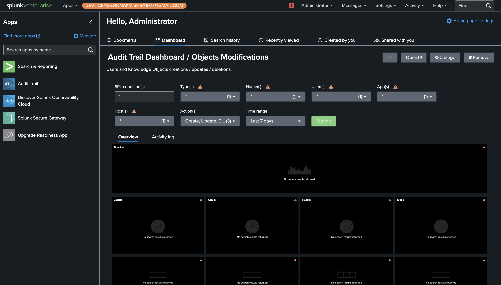
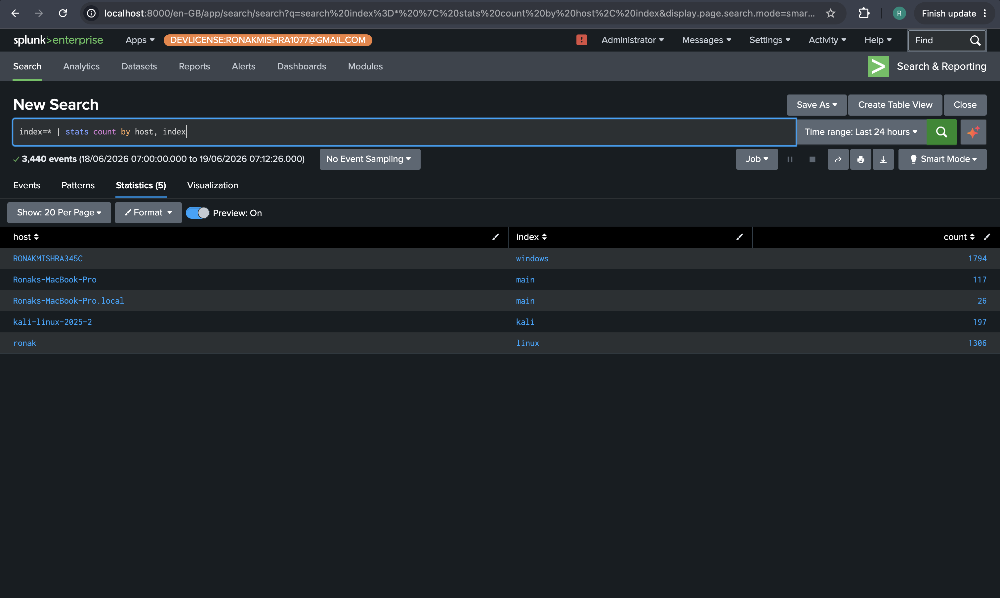
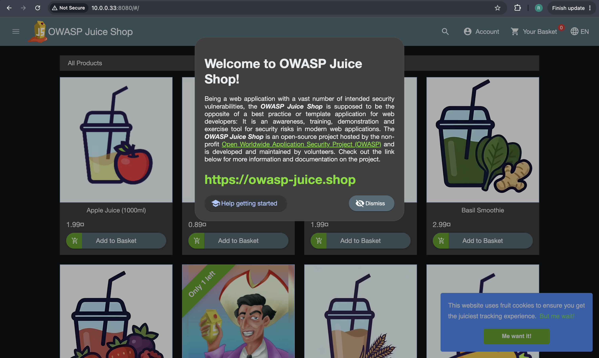
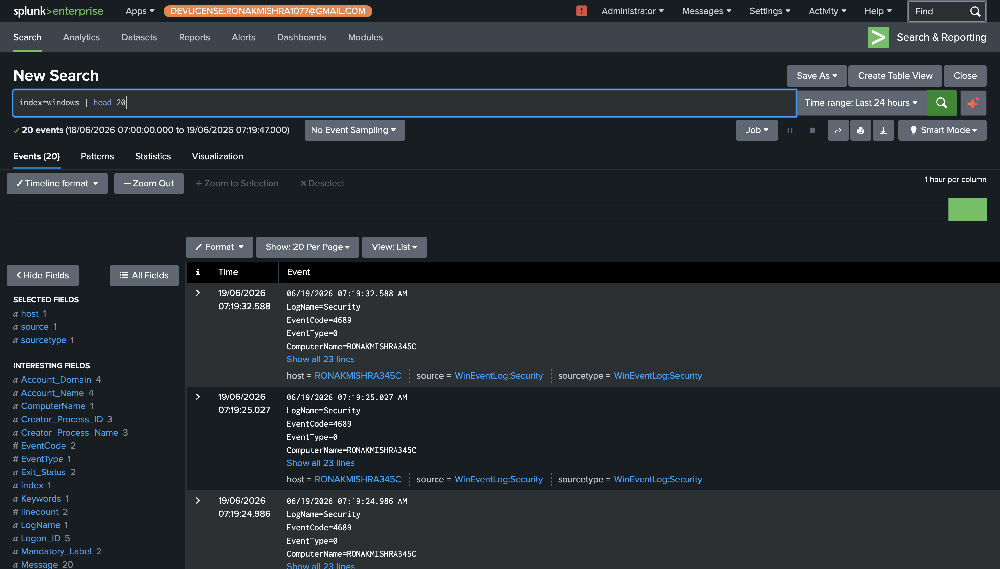
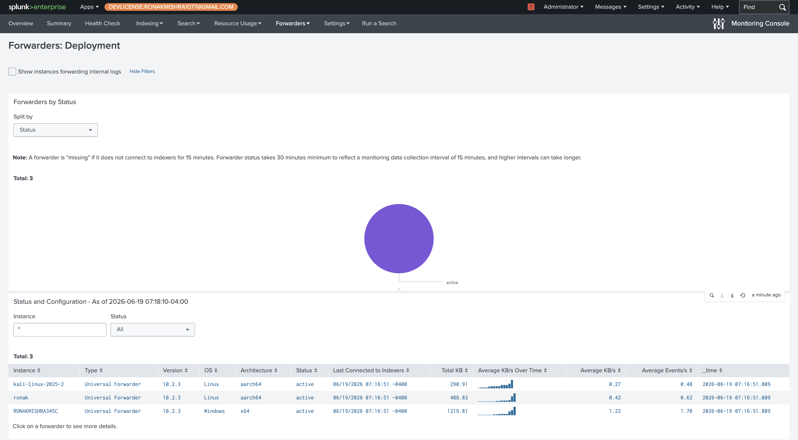

# Phase 1 — Architecture & Multi-Source Log Ingestion

The lab runs Splunk Enterprise on a MacBook M4 Pro as the central SIEM. Three virtual machines connect to it via Universal Forwarder, each shipping a different log source into its own dedicated Splunk index. OWASP Juice Shop is deployed on the Ubuntu VM via Docker and fronted by Nginx — Nginx is what generates the web application logs ingested into Splunk, not Juice Shop itself.

---

## Architecture

```
MacBook M4 Pro — Splunk Enterprise 10.2 (indexer + search head)
└── Parallels Desktop
    ├── WEB-PROD-01 · Ubuntu 22.04 (10.0.0.33)
    │     Docker → Juice Shop (port 3000, internal only)
    │     Nginx reverse proxy (port 8080) → logs to /var/log/nginx/juiceshop-access.log
    │     Universal Forwarder → webapp index (Nginx logs) + linux index (syslog/auth)
    │
    ├── FIN-WKS-04 · Windows 11 (10.0.0.32)
    │     Security + System + Application + PowerShell/Operational logs
    │     Universal Forwarder → windows index
    │
    └── Kali Linux (10.0.0.100)
          Attack machine only — no forwarder, never monitored
```

---

## Splunk Running with Developer License

Splunk Enterprise is live at `localhost:8000` with a 10GB/day Developer License (valid until October 2026). The orange banner confirms the license is active.



---

## All 3 Indexes Receiving Data

Running `index=* | stats count by host, index` confirms all three endpoints are actively forwarding logs. `webapp` receives Nginx access logs from WEB-PROD-01, `linux` receives syslog from the same machine, and `windows` receives Security Event Logs from FIN-WKS-04. This single query is the quickest proof that the full architecture is functional.



---

## Juice Shop Running via Nginx

Juice Shop loads in the browser at `http://10.0.0.33:8080` — confirming Nginx is correctly proxying requests to the Docker container on port 3000. Every user interaction from this point on generates a log line in `/var/log/nginx/juiceshop-access.log`, which Splunk then ingests into the `webapp` index.



---

## Webapp Index Receiving Nginx Logs

The `webapp` index is populated with `sourcetype=access_combined` — the standard Nginx combined log format. Splunk auto-extracts key fields from this format (`clientip`, `method`, `uri`, `status`, `bytes`, `useragent`) with no custom configuration needed. The host field shows `ronak` (WEB-PROD-01's hostname), source path confirms `/var/log/nginx/juiceshop-access.log`.


---

## Windows Security Logs Flowing

The `windows` index is receiving Security Event Logs from FIN-WKS-04 (`RONAKMISHRA345C`). EventCode 4689 (process termination) appears here — confirming the forwarder is connected and all Windows Security events are flowing. This same index will capture Event IDs 4663, 4103, and 5156 in Phase 5.



---

## All 3 Forwarders Confirmed Active

The Splunk Monitoring Console (Forwarders: Deployment view) shows all three endpoints connected simultaneously — `kali-linux-2025-2` (Linux, aarch64), `ronak` (Linux, aarch64), and `RONAKMISHRA345C` (Windows, x64) — all with `status: active` and timestamps from the same session. This is the definitive proof that the full multi-endpoint architecture is working.



---

## Config Files

All Universal Forwarder configuration files are in [`configs/`](../configs/):

- [`webprod01-inputs.conf`](../configs/webprod01-inputs.conf) — Ubuntu: monitors syslog, auth.log, and both Nginx log files
- [`finwks04-inputs.conf`](../configs/finwks04-inputs.conf) — Windows: monitors Security, System, Application, and PowerShell/Operational channels
- [`outputs.conf`](../configs/outputs.conf) — All forwarders point to `10.0.0.31:9997` (Mac Splunk)
- [`nginx-juiceshop-reverse-proxy.conf`](../configs/nginx-juiceshop-reverse-proxy.conf) — Nginx proxy config that routes port 8080 → Docker port 3000

---

← [Back to README](../README.md) · [Phase 2+3 →](phase2-3-spl-log-anatomy.md)
