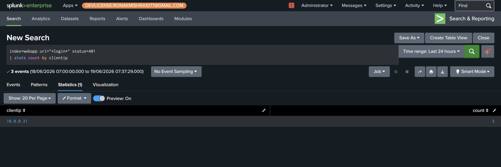

# Phase 2+3 — SPL Fundamentals & Log Anatomy

Before running any attacks, the Nginx access log format was studied and normal traffic baselines were established. Understanding what normal looks like is what makes anomalies detectable. Every detection query in Phase 4 and 5 builds directly on the SPL patterns introduced here.

---

## How SPL Works

SPL reads left to right. Everything before the first `|` filters which raw events to look at. Everything after `|` transforms or aggregates those events. This mental model holds for every query in this lab.

```spl
index=webapp uri="*login*" method=POST   ← filter: which events
| stats count by clientip                ← transform: count them by IP
| sort -count                            ← present: highest first
```

---

## HTTP Status Code Distribution — Baseline

`index=webapp | stats count by status` — groups all webapp events by HTTP status code. At baseline (before attacks), almost everything is `200 OK`. This baseline is what makes the 1,500-event spike of `401 Unauthorized` events during the credential stuffing attack immediately visible as an anomaly.


---

## HTTP Method Breakdown

`index=webapp | stats count by method` — shows the split between GET requests (browsing, loading pages) and POST requests (login, basket operations). Normal ratio is heavily GET-dominant. An unusual volume of POST requests to a single endpoint is a signal worth investigating — which is exactly what credential stuffing produces.


---

## User Agent Baseline — Critical for Attack Detection

`index=webapp | top useragent` — at baseline, 100% of traffic comes from a single real browser: Chrome on Mac. This is the most important baseline screenshot in the lab. When attack tools run in Phase 4, their user agents (`curl/8.14.1`, or no user agent at all) appear against this completely uniform background — making them trivially detectable as non-human traffic.


---

## Login Activity Baseline

`index=webapp uri="*login*" method=POST | stats count by status` — at baseline, there are 3 failed logins (401) and 1 successful login (200) from normal browsing. This is what legitimate user behavior looks like. The Phase 4 credential stuffing attack will produce hundreds of 401s from a single IP in under 2 minutes — an obvious departure from this baseline.


---

## Failed Logins by IP — Foundation of Brute Force Detection

`index=webapp uri="*login*" status=401 | stats count by clientip` — at baseline, only one IP (`10.0.0.31`, the analyst's Mac) shows failed logins, with a count of 3. This is the exact query that becomes the brute force detection in Phase 4. After Hydra runs from Kali, this same query shows `10.0.0.100` with 1,400+ attempts — the contrast with this baseline makes the detection threshold meaningful.



---

## Key SPL Commands Reference

| Command | Used for |
|---|---|
| `stats count by X` | Count events grouped by a field |
| `timechart count by X` | Plot counts over time (used in dashboard panels) |
| `rex field=X "regex"` | Extract a new field using a regex pattern (used in IDOR detection) |
| `top X` | Most common values of a field |
| `transaction host maxspan=30m` | Group related events into one correlated incident (centerpiece of Phase 5) |
| `bucket _time span=1m` | Group events into time windows (used in brute force threshold detection) |
| `where match(X, "pattern")` | Filter events using regex (used in injection and traversal detection) |

---

← [Phase 1](phase1-architecture.md) · [Back to README](../README.md) · [Phase 4 →](phase4-owasp-detection.md)
