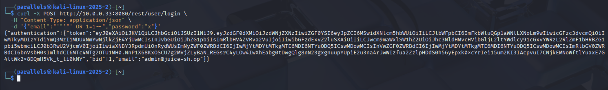
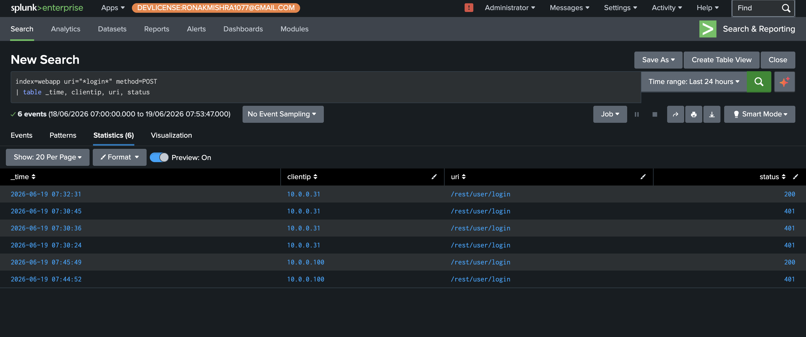
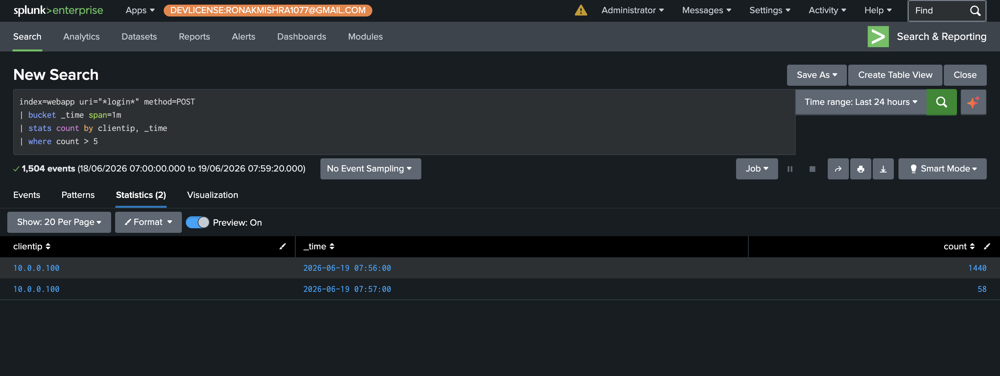
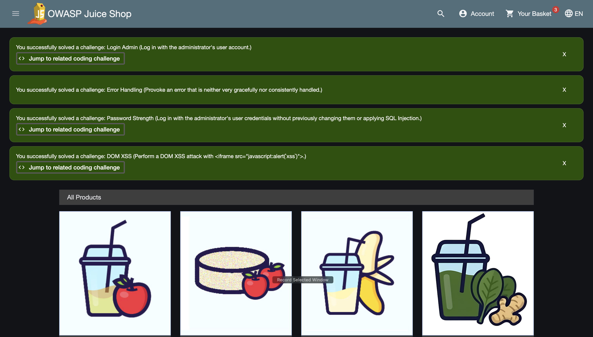
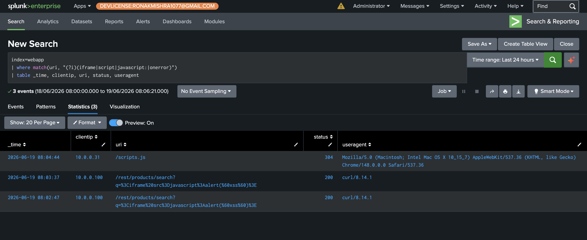
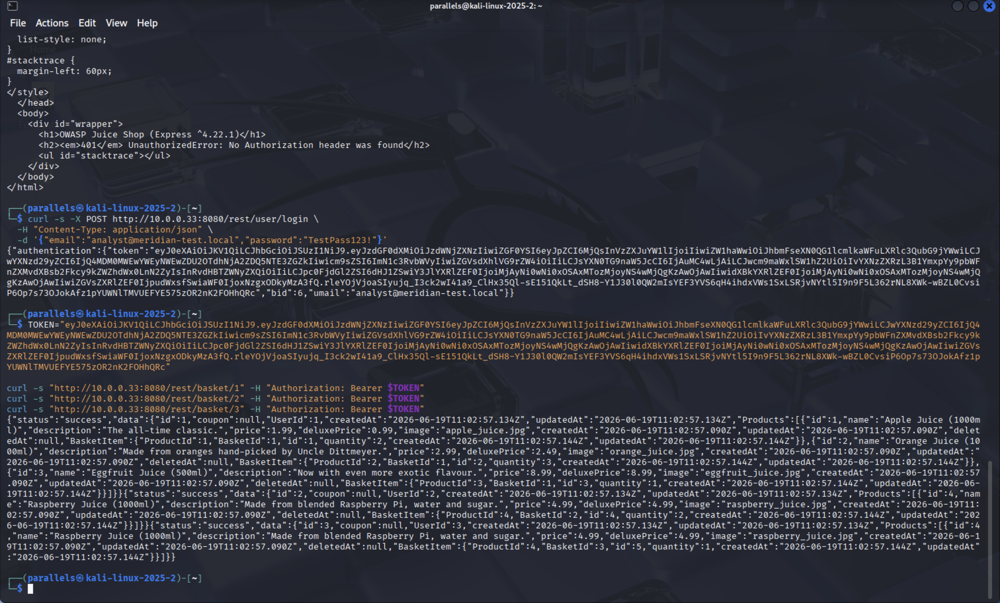
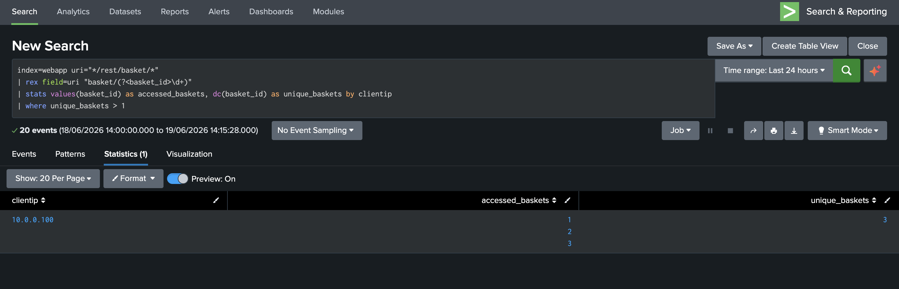
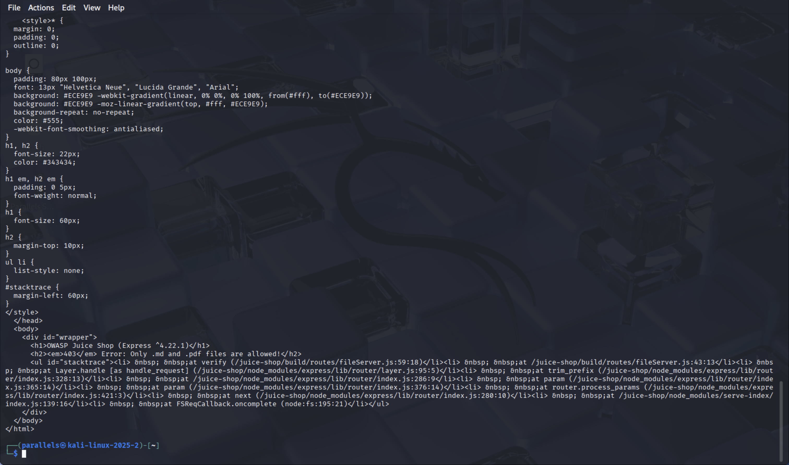
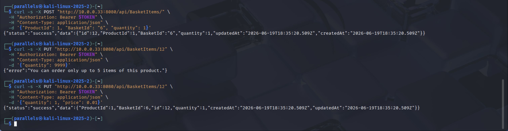

# Phase 4 — OWASP Top 10 Attack Detection

Six OWASP Top 10 attacks executed from Kali (10.0.0.100) against WEB-PROD-01 (10.0.0.33:8080). Each attack is fully documented: what was run, what the result was, how it shows up in Splunk, and what the genuine detection limitations are. Two attacks were successfully blocked — those are documented as positive findings with equal rigor.

---

## Attack 1 — SQL Injection (Login Bypass)
**OWASP A03 · MITRE T1190**

A single crafted email field (`' OR 1=1--`) causes the login query to evaluate as always-true, returning a valid JWT authentication token for the admin account without knowing the password.

```bash
curl -X POST http://10.0.0.33:8080/rest/user/login \
  -H "Content-Type: application/json" \
  -d '{"email":"'\'' OR 1=1--","password":"x"}'
```

The response comes back with a full admin JWT token — `"email":"admin@juice-sh.op"`, `"role":"admin"`. Complete authentication bypass in one request.



**Detection query:**
```spl
index=webapp uri="*login*" method=POST
| stats count, values(status) as statuses by clientip
```
This shows login attempt volume and status codes grouped by source IP. In Phase 3 the baseline for `10.0.0.31` was 3 failed + 1 successful. After the attack, `10.0.0.100` appears with a 200 status — but this alone can't distinguish SQLi from a legitimate login.



**Finding:** Nginx access logs capture only the request line and headers — never the POST body. The `' OR 1=1--` payload was transmitted in the JSON body and is completely absent from Splunk. Detection is behavioral only (IP + status pattern). Catching the actual payload requires a WAF with body inspection or application-level logging. This detection gap is documented in [IR-MER-2026-001](../incident-reports/IR-MER-2026-001-external-webapp-attack.md).

---

## Attack 2 — Credential Stuffing
**OWASP A07 · MITRE T1110.004**

Eight common passwords tested against the admin account using a bash loop with proper JSON formatting. No special tooling — just `curl` in a loop, which is realistic for modern credential stuffing attacks targeting JSON APIs.

The account had no rate limiting and no lockout policy. Password `admin123` succeeded on the 3rd attempt.


**Detection query:**
```spl
index=webapp uri="*login*" method=POST
| bucket _time span=1m
| stats count by clientip, _time
| where count > 5
```
Groups login POSTs into 1-minute buckets and flags any IP exceeding 5 attempts per minute. Unlike SQLi, this attack is fully visible from access logs — detection is based on volume and timing, not payload content.


**Alert threshold confirmation** — the scheduled alert query returns results showing the attack window:



**Finding:** Clean detection. The attack generates a spike of 401s from a single IP in a narrow time window — completely unambiguous against the baseline established in Phase 3 where the same endpoint had 3 failed logins total.

---

## Attack 3 — DOM-Based XSS
**OWASP A03 · MITRE T1190**

The Juice Shop search bar reflects the `q` parameter directly into the Angular DOM without sanitizing it. Navigating to `/#/search?q=<iframe src="javascript:alert('xss')">` executes arbitrary JavaScript in the victim's browser.


Juice Shop's own internal challenge tracker independently confirms the attack succeeded:



**Detection query:**
```spl
index=webapp
| where match(uri, "(?i)(iframe|script|javascript:|onerror)") AND NOT match(uri, "\.js$")
| table _time, clientip, uri, status, useragent
```
This catches the same payload when sent via curl directly to the `/rest/products/search` API endpoint — `curl/8.14.1` user agent is clearly visible alongside the injection syntax.



**Finding:** The browser-based DOM XSS is completely invisible to server-side logs. URL fragments (`#/search?q=...`) are stripped by the browser before the HTTP request is made — the server never sees them. This class of attack requires CSP headers or client-side monitoring to detect. The detection above only catches the API-layer curl variant, not the actual browser exploitation.

---

## Attack 4 — IDOR (Broken Access Control)
**OWASP A01 · MITRE T1190**

The application correctly checks authentication (valid JWT required) but never checks authorization (does this basket belong to the authenticated user?). Using a valid token for account `analyst@meridian-test.local` (basket ID 6), baskets 1, 2, and 3 belonging to other users are accessed directly by manipulating the ID in the URL.



**Detection query:**
```spl
index=webapp uri="*/rest/basket/*"
| rex field=uri "basket/(?<basket_id>\d+)"
| stats values(basket_id) as accessed_baskets, dc(basket_id) as unique_baskets by clientip
| where unique_baskets > 1
```
Extracts the basket ID from each URI, counts distinct IDs accessed per source IP, and flags anything above 1. A legitimate user only ever needs their own basket.



**Finding:** 10.0.0.100 accessed basket IDs 1, 2, and 3 — `unique_baskets=3`. This detection works entirely from URI patterns with no body inspection required. The signal is purely behavioral: sequential ID enumeration across a resource that should be scoped to the authenticated user.

---

## Attack 5 — Path Traversal
**OWASP A05 · MITRE T1190**

Attempts to access files outside the web root by encoding `../` sequences in the URL. Two techniques tested to evaluate defense depth.

**Single-encoded (blocked at Nginx proxy layer):**
```bash
curl "http://10.0.0.33:8080/ftp/..%2f..%2fetc%2fpasswd"
# → 400 Bad Request from Nginx
```

**Double-encoded (bypasses Nginx, reaches application):**
```bash
curl "http://10.0.0.33:8080/ftp/..%252f..%252fetc%252fpasswd"
# → 403: "Only .md and .pdf files are allowed"
```



**Detection query:**
```spl
index=webapp
| where match(uri, "(?i)(%2e%2e%2f|\.\.%2f|\.\./|%252e%252e|%252f)")
| table _time, clientip, uri, status
```
Matches both single and double-encoded traversal patterns. The double-encoded attempt is clearly visible in the URI field.


**Finding:** Two-layer defense confirmed. Nginx blocks standard encoding at the proxy level. Double-encoding bypasses Nginx normalization but hits the application's own file extension whitelist. Additional finding: the 403 error response leaked internal file paths (`/juice-shop/build/routes/fileServer.js`) — information disclosure that would help an attacker map the application's internals.

---

## Attack 6 — Price Tampering (Business Logic Abuse)
**OWASP A04 · MITRE T1565.001**

Attempts to inject a client-supplied `price` field into the basket item update API, bypassing server-side price calculation to purchase items below their actual price.

```bash
curl -X PUT "http://10.0.0.33:8080/api/BasketItems/12" \
  -H "Authorization: Bearer $TOKEN" \
  -H "Content-Type: application/json" \
  -d '{"quantity": 1, "price": 0.01}'
```

The response returns `status: success` but the `price` field is absent from the returned object — it was silently ignored. Price is calculated server-side from the product catalog at checkout, never stored per basket item.



**Finding:** Not exploitable. This is a positive finding — the server-side price calculation correctly prevents this attack. Documenting a defended surface is as important as documenting a successful exploit; it shows the test was thorough, not just cherry-picked for wins.

---

← [Phase 2+3](phase2-3-spl-log-anatomy.md) · [Back to README](../README.md) · [Phase 5 →](phase5-insider-threat.md)
