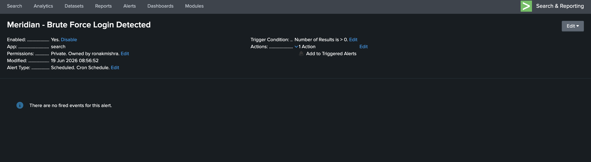
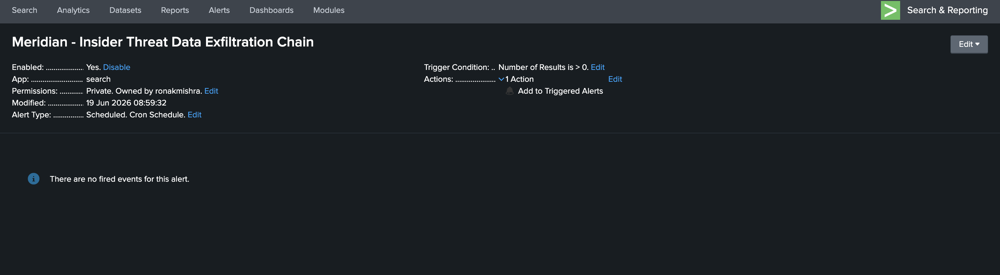
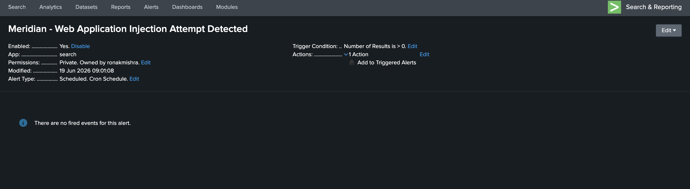

# Phase 6 — Detection Engineering & Alerts

The three core detection queries from Phase 4 and 5 are converted into scheduled Splunk alerts that run automatically and feed the SOC dashboard. Each alert includes a tuning note — understanding what causes false positives is part of detection engineering, not just writing the query.

---

## Alert 1 — Brute Force Login Detected

Fires when any single IP exceeds 5 POST requests to the login endpoint within a 1-minute window. Threshold chosen to avoid flagging a legitimate user mistyping their password (2-3 attempts) while reliably catching automated tooling (hundreds of attempts per minute).

**Severity:** High · **Schedule:** Every 5 minutes (`*/5 * * * *`)

```spl
index=webapp uri="*login*" method=POST
| bucket _time span=1m
| stats count by clientip, _time
| where count > 5
```



**Tuning note:** During testing, a 1,440-events-per-minute anomaly appeared from background socket.io polling traffic misclassified as login requests. In production, known health-check IPs and service accounts should be excluded with an additional `NOT clientip IN ("x.x.x.x")` clause.

---

## Alert 2 — Insider Threat Data Exfiltration Chain

The highest-value alert in the lab. Only fires when all three stages of the insider kill chain (file access + compression + outbound connection) occur on the same host within 30 minutes. Near-zero false positive risk in practice — legitimate backup processes rarely combine file access to a sensitive directory, compression, and an outbound curl to a non-standard port within the same 30-minute window.

**Severity:** Critical · **Schedule:** Every 10 minutes (`*/10 * * * *`)

```spl
index=windows (EventCode=4663 Object_Name="*CustomerExports*")
    OR (EventCode=4103 _raw="*CompressFilesHelper*")
    OR (EventCode=5156 Destination_Port=4444)
| transaction host maxspan=30m
| where eventcount >= 3
```



**Tuning note:** If the organization runs a legitimate scheduled backup of `CustomerExports`, exclude the backup service account from the 4663 filter, or require the combination of *all three stages* (which a backup process wouldn't trigger since it doesn't use curl to an external IP).

---

## Alert 3 — Web Application Injection Attempt

Flags any request URI containing common injection syntax patterns. The `.js$` exclusion prevents static JavaScript files from matching — without it, files like `utils.js` would trigger false positives on every page load.

**Severity:** High · **Schedule:** Every 5 minutes (`*/5 * * * *`)

```spl
index=webapp
| where match(uri, "(?i)(or\s+1=1|--|iframe|script|javascript:)") AND NOT match(uri, "\.js$")
| table _time, clientip, uri, status, useragent
```



**Tuning note:** Non-browser user agents (`curl`, `sqlmap`, `python-requests`) alongside injection syntax should be treated as high-confidence positives. A real browser hitting a page that happens to contain `--` in a product name is a candidate for exclusion based on the full URI context.

---

← [Phase 5](phase5-insider-threat.md) · [Back to README](../README.md) · [Phase 7 →](phase7-dashboard-incidents.md)
