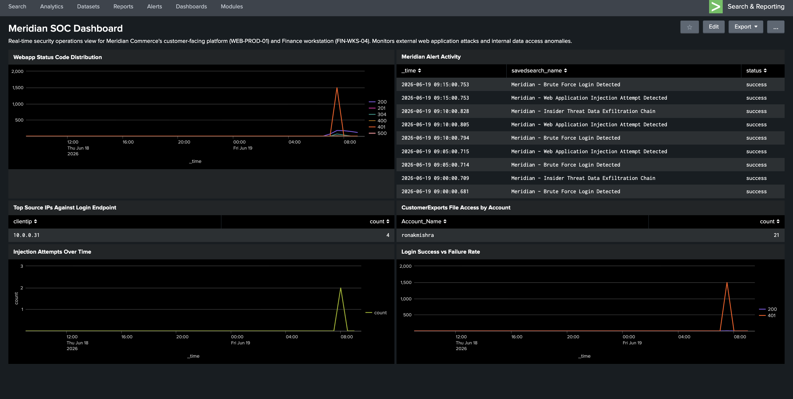

# Phase 7 — Dashboard & Incident Reports

---

## Meridian SOC Dashboard

All 6 panels run live SPL queries against real attack data generated during the lab. The dashboard is what a Tier 1 analyst would open at the start of a shift to assess the current security posture of Meridian's environment.

**What each panel shows:**

**Webapp Status Code Distribution (top left)** — Status codes plotted over time. The orange spike at 07:00–08:00 is the `401 Unauthorized` flood from the credential stuffing attack — immediately visible as an anomaly against the flat baseline that preceded it.

**Meridian Alert Activity (top right)** — The live alert execution log showing all three scheduled alerts firing on their `*/5` and `*/10` cron schedules with `status: success`. This confirms the detection pipeline is operational, not just configured.

**Top Source IPs Against Login Endpoint (middle left)** — After applying the false-positive filter from Phase 6, `10.0.0.31` (the analyst's own Mac) shows 4 legitimate login attempts. In an unfiltered view, `10.0.0.100` (Kali) showed 1,440+ — the most obvious signal on the entire dashboard.

**CustomerExports File Access by Account (middle right)** — `ronakmishra` with 21 file access events against the sensitive `CustomerExports` directory. This panel alone would trigger an investigation — a Finance account shouldn't be accessing that folder 21 times in a single session.

**Injection Attempts Over Time (bottom left)** — The XSS and path traversal attempts from Phase 4 appear as a small spike. Low volume compared to the credential stuffing, but the spike against a zero baseline is unambiguous.

**Login Success vs Failure Rate (bottom right)** — The credential stuffing pattern is visible: mass 401 failures followed by a single 200 success — the exact signature of a password being cracked after enumeration.

---

## Incident Reports

Two formal incident reports written in the style a SOC analyst would produce after completing an investigation.

### IR-MER-2026-001 — External Web Application Attack
**Severity: High**

Documents the Phase 4 attack chain: SQL injection admin bypass, credential stuffing (admin cracked via `admin123`), and DOM-based XSS. The report covers the full timeline, what was detected vs what wasn't and why (the Nginx body-logging gap and DOM fragment blind spot), business impact assessment (full admin access to customer platform), and specific remediation recommendations (WAF deployment, strong password enforcement, CSP headers).

→ [Read IR-MER-2026-001](../incident-reports/IR-MER-2026-001-external-webapp-attack.md)

### IR-MER-2026-002 — Insider Threat Data Exfiltration
**Severity: Critical**

Documents the Phase 5 kill chain: unauthorized file access, compression staging, and exfiltration via curl to an external host. The report includes the technical finding about PowerShell cmdlets bypassing Event ID 4688, the three default-disabled audit subcategories required for detection, business impact (customer payment data — PCI-relevant, potential mandatory breach notification), and recommendations including DLP controls, outbound port restrictions, and least-privilege review on file share access.

→ [Read IR-MER-2026-002](../incident-reports/IR-MER-2026-002-insider-data-exfiltration.md)

---

← [Phase 6](phase6-alerts.md) · [Back to README](../README.md)
