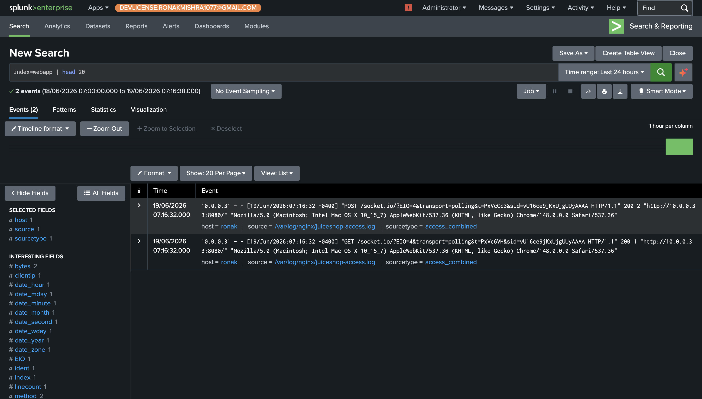

# Phase 1 — Architecture & Multi-Source Log Ingestion

Splunk Enterprise is deployed on the host Mac as the central SIEM. Three endpoints connect via Universal Forwarder, each shipping a distinct log source into its own index. Keeping logs in separate indexes prevents cross-contamination between data types and reflects how enterprise SIEMs are typically organized — web application logs, Linux host logs, and Windows endpoint logs each have different retention policies, access controls, and query patterns in production.

OWASP Juice Shop runs in Docker on the Ubuntu VM. Nginx sits in front of it as a reverse proxy — this is the architecturally important piece, because Nginx is what writes the access logs that Splunk ingests. Juice Shop itself produces no structured logs useful for detection.

---

## Architecture

```
MacBook M4 Pro — Splunk Enterprise 10.2 (indexer + search head)
└── Parallels Desktop
    ├── WEB-PROD-01 · Ubuntu 22.04 (10.0.0.33)
    │     Docker → Juice Shop (port 3000, internal only)
    │     Nginx reverse proxy (port 8080) → /var/log/nginx/juiceshop-access.log
    │     Universal Forwarder → webapp (Nginx) + linux (syslog/auth) indexes
    │
    ├── FIN-WKS-04 · Windows 11 (10.0.0.32)
    │     Security + System + Application + PowerShell/Operational logs
    │     Universal Forwarder → windows index
    │
    └── Kali Linux (10.0.0.100)
          Attack machine — no forwarder installed
```

---

## All 3 Endpoints Connected and Sending Data

`index=* | stats count by host, index` confirms all three endpoints are actively forwarding. Each host maps to its correct index, and event counts confirm data is flowing — not just that the forwarders are installed, but that logs are actively being received and indexed.


---

## Juice Shop Accessible via Nginx

Juice Shop is reachable at `http://10.0.0.33:8080`, confirming the Nginx reverse proxy is correctly routing traffic to the Docker container. Every HTTP request made to this address generates a log entry in `access_combined` format — the standard Nginx log format from which Splunk auto-extracts `clientip`, `method`, `uri`, `status`, `bytes`, and `useragent` with no custom configuration.


---

## Webapp Index Receiving Nginx Access Logs

The `webapp` index contains events from `/var/log/nginx/juiceshop-access.log` with `sourcetype=access_combined`. The left-hand field panel shows Splunk has automatically extracted `clientip`, `method`, `uri`, `status`, and `bytes` — all the fields needed for OWASP attack detection without any custom field extraction.



---

## Windows Security Event Logs Flowing

The `windows` index is receiving Security Event Logs from FIN-WKS-04. The presence of events here confirms the forwarder is connected and all Windows Security channel events are being forwarded — including the Event IDs 4663, 4103, and 5156 that will detect the insider threat in Phase 5.


---

## All 3 Forwarders Simultaneously Active

The Monitoring Console (Forwarders: Deployment) shows `kali-linux-2025-2` (Linux/aarch64), `ronak` (Linux/aarch64), and `RONAKMISHRA345C` (Windows/x64) all connected at the same time with `status: active`. This confirms the full architecture is operational as a unit — not just individual components working in isolation.


---

## Config Files

- [`configs/webprod01-inputs.conf`](../configs/webprod01-inputs.conf) — Ubuntu UF monitors syslog, auth.log, and both Nginx log files
- [`configs/finwks04-inputs.conf`](../configs/finwks04-inputs.conf) — Windows UF monitors Security, System, Application, and PowerShell/Operational channels
- [`configs/outputs.conf`](../configs/outputs.conf) — All forwarders point to `10.0.0.31:9997`
- [`configs/nginx-juiceshop-reverse-proxy.conf`](../configs/nginx-juiceshop-reverse-proxy.conf) — Nginx proxy routing port 8080 to Docker port 3000

---

← [Back to README](../README.md) · [Phase 2+3 →](phase2-3-spl-log-anatomy.md)
