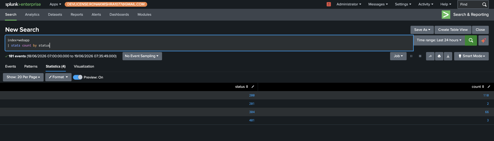
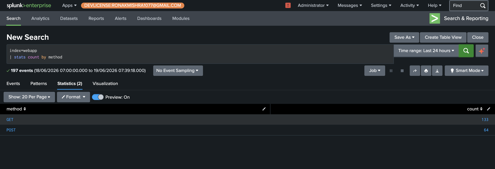
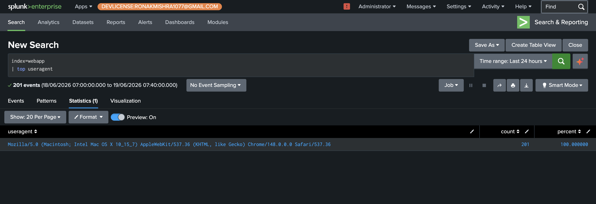
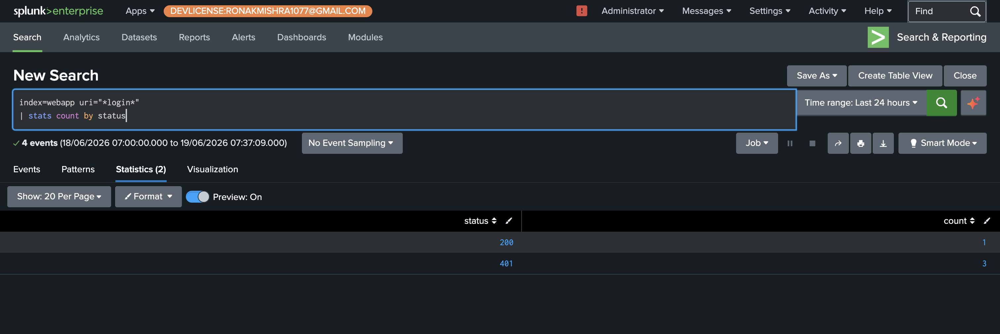

# Phase 2+3 — SPL Fundamentals & Log Anatomy

## Overview
Before running any attacks, the Nginx access log format was profiled and normal traffic baselines were established. This phase covers the core SPL commands used throughout every detection in this lab, and demonstrates what normal Juice Shop traffic looks like so anomalies stand out clearly in Phase 4.

---

## SPL Mental Model

Every SPL query reads left to right. The part before the first `|` filters raw events. Everything after `|` transforms or aggregates them.

```
index=webapp uri="*login*" method=POST    ← which events
| stats count by clientip                 ← what to do with them
| sort -count                             ← how to present it
```

---

## Core Commands Used in This Lab

| Command | What it does | Example |
|---|---|---|
| `stats count by X` | Count events grouped by a field | Count failed logins per IP |
| `timechart count by X` | Plot counts over time | Attack spike visualization |
| `rex field=X "regex"` | Extract a new field using regex | Pull basket ID from URI |
| `top X` | Show most common values | Top URIs, top user agents |
| `transaction` | Group related events into one | Correlate multi-stage attack |
| `bucket _time span=1m` | Group events into time buckets | Rate-limiting detection |
| `where match(X, "regex")` | Filter events by regex pattern | Find injection payloads in URI |

---

## Nginx Log Field Extraction

The `access_combined` sourcetype auto-extracts these fields — no custom configuration needed:



---

## HTTP Method Breakdown — Normal Traffic

```spl
index=webapp | stats count by method
```

Normal ratio: mostly GET (page browsing) with a portion of POST (login, basket operations). Any unusual PUT/DELETE volume is worth investigating.



---

## User Agent Baseline

```spl
index=webapp | top useragent
```

Before any attacks, 100% of traffic comes from a single real browser (Chrome on Mac). This makes attack tooling immediately visible — `curl/8.14.1`, `sqlmap`, or missing user agents stand out completely against this baseline.



---

## Login Activity Breakdown

```spl
index=webapp uri="*login*" method=POST
| stats count by status
```

Baseline: a handful of 401s (failed logins) and one 200 (successful login). Any spike in 401s from a single IP is the first signal of credential stuffing.



---

## Failed Logins by IP — First Detection Pattern

```spl
index=webapp uri="*login*" status=401
| stats count by clientip
```

This single query is the foundation of the brute force detection built in Phase 4. At baseline it shows 1 IP with 3 failed attempts. After Hydra runs, it shows 1 IP with 1,440+ attempts.


---

← [Phase 1](phase1-architecture.md) | [Back to README](../README.md) | [Phase 4 →](phase4-owasp-detection.md)
