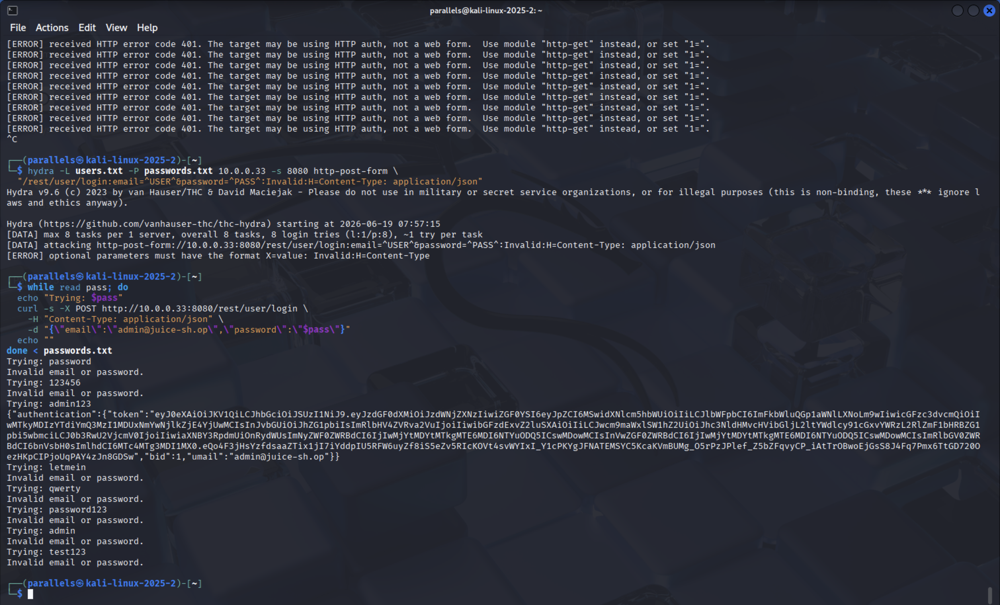
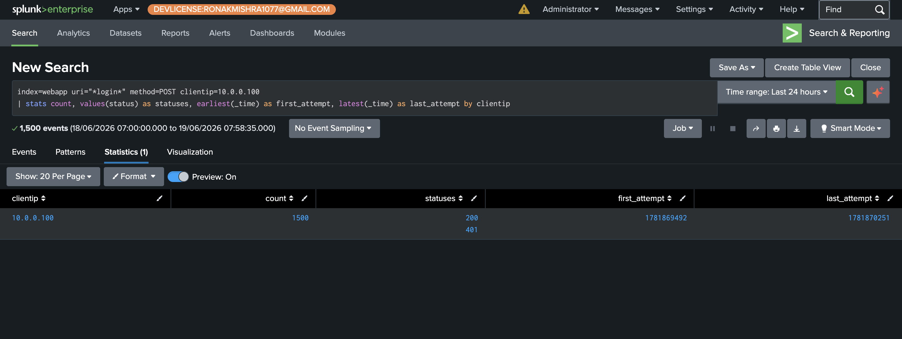
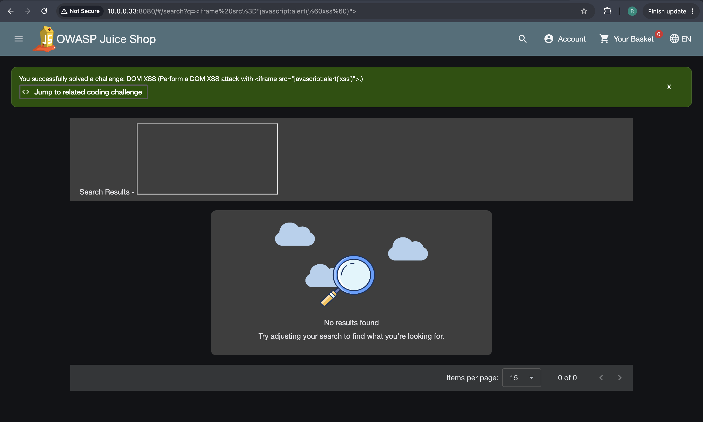
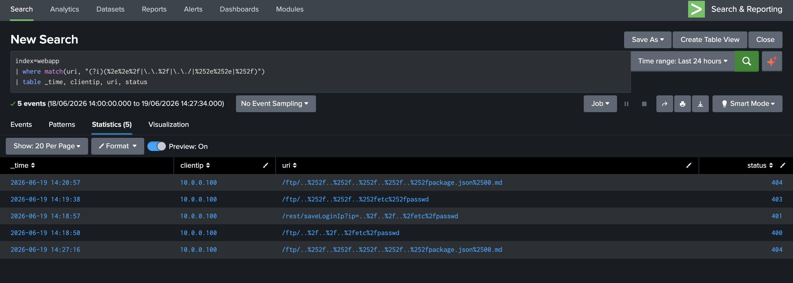

# Phase 4 — OWASP Top 10 Attack Detection

Six attacks executed from Kali (10.0.0.100) against WEB-PROD-01 (10.0.0.33:8080). Each attack documents the technique, the result, the SPL detection query, and the honest assessment of what is and isn't detectable from standard web server logs. Two attacks were blocked — those findings are documented with equal rigor.

---

## Attack 1 — SQL Injection (Login Bypass)
**OWASP A03 · MITRE T1190**

Injecting `' OR 1=1--` into the email field causes the underlying SQL query to evaluate as always-true, bypassing authentication entirely. No knowledge of the actual admin password is required.

```bash
curl -X POST http://10.0.0.33:8080/rest/user/login \
  -H "Content-Type: application/json" \
  -d '{"email":"'\'' OR 1=1--","password":"x"}'
```

The response returns a valid JWT for `admin@juice-sh.op` with `"role":"admin"` — full administrative access to the platform granted without credentials.


**Detection query:**
```spl
index=webapp uri="*login*" method=POST
| stats count, values(status) as statuses by clientip
```

This query surfaces login attempt volume and outcome by source IP. Kali's IP (`10.0.0.100`) appears with a `200` response — but the query cannot distinguish a legitimate login from an SQLi bypass because the payload was in the POST body.


**Finding:** Nginx access logs record the request line and headers only — never the POST body. The injection payload never appears in Splunk. Detection is limited to behavioral signals (unusual IP, status pattern). This is a real architectural limitation documented in [IR-MER-2026-001](../incident-reports/IR-MER-2026-001-external-webapp-attack.md). Closing this gap requires a WAF with request body inspection or application-level logging.

---

## Attack 2 — Credential Stuffing
**OWASP A07 · MITRE T1110.004**

Eight common passwords tested against the admin account using a curl loop with correct JSON formatting. The endpoint had no rate limiting and no account lockout. `admin123` succeeded on the third attempt.



**Detection query:**
```spl
index=webapp uri="*login*" method=POST
| bucket _time span=1m
| stats count by clientip, _time
| where count > 5
```

Groups login POSTs into 1-minute buckets and flags any source IP exceeding 5 attempts per minute — a threshold grounded in the Phase 3 baseline where the entire pre-attack login history was 3 failed attempts total.



**Alert threshold query result** — the query the scheduled alert runs on:


**Finding:** Unlike SQLi, this attack is fully visible from access logs — the signal is volume and timing, not payload content. The contrast with Phase 3 baseline (3 failed logins vs. 1,400+) makes the detection unambiguous.

---

## Attack 3 — DOM-Based XSS
**OWASP A03 · MITRE T1190**

The Juice Shop search parameter is reflected into the Angular DOM without sanitization. Navigating to `/#/search?q=<iframe src="javascript:alert('xss')">` executes arbitrary JavaScript in the browser — a delivery mechanism for session hijacking, credential theft, or malicious redirects.



Juice Shop's internal challenge tracker independently confirms the attack succeeded:


**Detection query** (catches the same payload sent directly via curl to the API):
```spl
index=webapp
| where match(uri, "(?i)(iframe|script|javascript:|onerror)") AND NOT match(uri, "\.js$")
| table _time, clientip, uri, status, useragent
```


**Finding:** The browser-based DOM XSS is completely undetectable from server logs. URL fragments (`#/search?q=...`) are stripped by the browser before making the HTTP request — the server never receives the payload. The detection above only catches the curl-based API variant. Closing this gap requires Content Security Policy headers. This is a genuine blind spot relevant to any application using client-side routing.

---

## Attack 4 — IDOR (Broken Access Control)
**OWASP A01 · MITRE T1190**

The application checks authentication (valid JWT required) but not authorization (does this basket belong to the requesting user?). Using a valid token for account `analyst@meridian-test.local` (basket ID 6), baskets 1, 2, and 3 belonging to other users are accessed by sequentially incrementing the ID in the API path.


**Detection query:**
```spl
index=webapp uri="*/rest/basket/*"
| rex field=uri "basket/(?<basket_id>\d+)"
| stats values(basket_id) as accessed_baskets, dc(basket_id) as unique_baskets by clientip
| where unique_baskets > 1
```

Extracts basket IDs from each URI and flags any source IP accessing more than one distinct basket. A legitimate user has exactly one basket.


**Finding:** Clean detection from URI patterns alone — no payload inspection needed. Sequential ID enumeration across a user-scoped resource produces a distinctive behavioral signature that cannot be produced by legitimate usage.

---

## Attack 5 — Path Traversal
**OWASP A05 · MITRE T1190**

Directory traversal attempts to read files outside the web root by encoding `../` sequences in the URL. Two encoding variants tested to assess defense depth.

Standard encoding (`..%2f`) — blocked by Nginx at the proxy layer before reaching the application. Double encoding (`..%252f`) — bypasses Nginx normalization, reaches Juice Shop, and is blocked by the application's own file extension whitelist (only `.md` and `.pdf` files permitted). The 403 response also leaked internal file paths in the stack trace — minor information disclosure that would assist an attacker in mapping the application.


**Detection query:**
```spl
index=webapp
| where match(uri, "(?i)(%2e%2e%2f|\.\.%2f|\.\./|%252e%252e|%252f)")
| table _time, clientip, uri, status
```



**Finding:** Two-layer defense confirmed effective. The detection catches both encoding variants, which is important — a detection that only matches `%2e%2e%2f` would miss the double-encoded bypass that actually reached the application.

---

## Attack 6 — Price Tampering (Business Logic Abuse)
**OWASP A04 · MITRE T1565.001**

Attempting to inject a client-supplied `price` field into the basket item update API to purchase items below their listed price.

```bash
curl -X PUT "http://10.0.0.33:8080/api/BasketItems/12" \
  -H "Authorization: Bearer $TOKEN" \
  -H "Content-Type: application/json" \
  -d '{"quantity": 1, "price": 0.01}'
```

The response returns `status: success` but the price field is absent from the returned object. Juice Shop calculates price server-side from the product catalog at checkout — the client-supplied price value is silently ignored.


**Finding:** Not exploitable. This is a positive finding — the application's design correctly prevents client-side price manipulation. Documenting a successfully defended surface demonstrates thorough testing, not just searching for exploitable vulnerabilities.

---

← [Phase 2+3](phase2-3-spl-log-anatomy.md) · [Back to README](../README.md) · [Phase 5 →](phase5-insider-threat.md)
